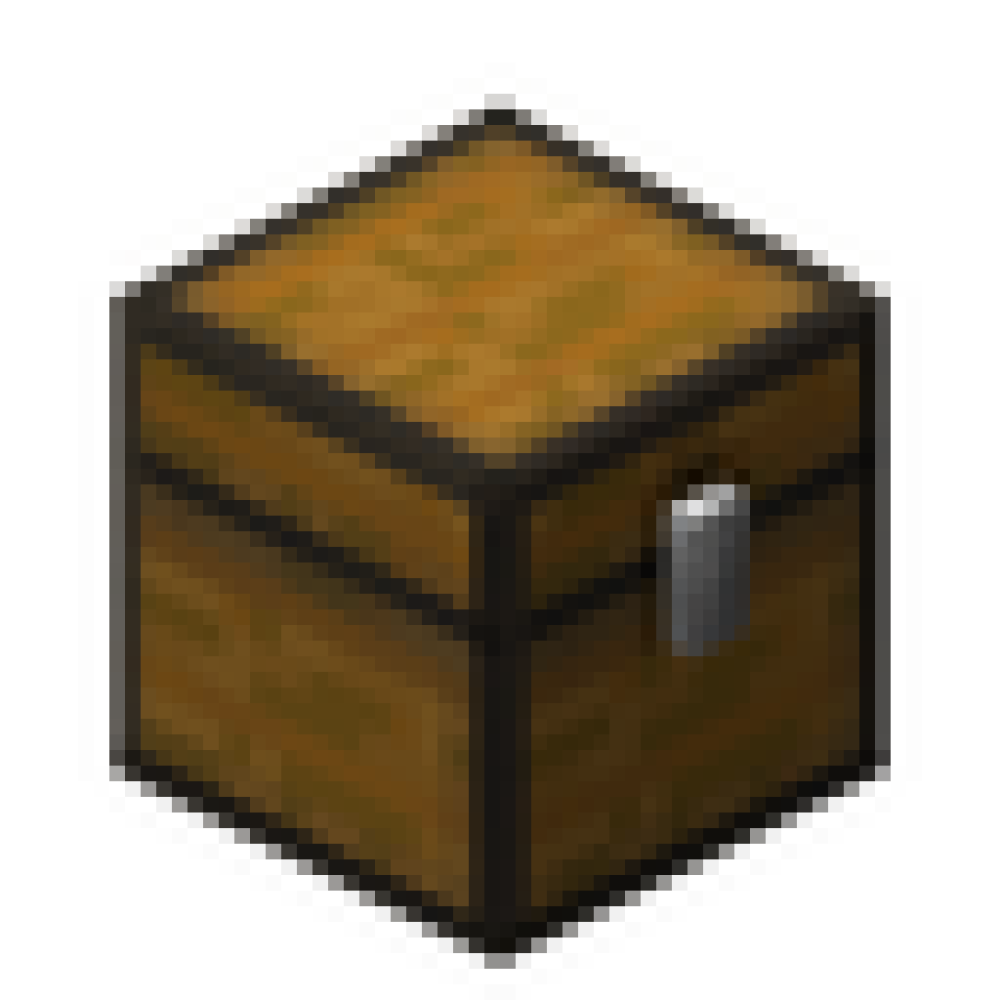

  

  <h1>Auto Sail</h1>

 
 

## **介绍**

配合 Baritone 自动挖矿模组使用的辅助工具，此模组能够实现背包装满后回家存放，并再次返回矿区。可在死亡后自动重生并返回矿区。

 
 

## **教程**

  

点击上方封面图观看演示视频

 
 

## **版本更新**

- **v1.0 版本**：背包装满后回家存放；
- **v1.1 版本**：新增死亡后自动重生并返回矿区；
- **v1.2 版本**：新增 add 可执行多条指令；
- **v1.3 版本**：新增可记忆指令，退出游戏依然保存先前设置的指令； 新增可自定义延迟，可自定义指令与指令之间的间隔时间，以秒为单位；
- **v1.4 版本**：新增检测处于指令延迟倒计时中玩家的异常移动，移动将重新执行上一条自定义指令；
- **v1.5 版本**：新增自定义背包放入延迟指令`/autosail delay %秒`；新增背包放入切换，全部放入或保留一个原物品`/autosail dumpall`。
- **v1.6 版本**：缩短固定指令延迟并移除固定指令延迟聊天框输出显示；移除add2中固定输出的`#stop`指令；优化自定义指令可在`<指令1>`前添加延迟，例`/autosail add1 %秒 <指令1> %秒 <指令2> ...`。

 
 

## **命令**

- `/autosail add1 %秒 <指令1> %秒 <指令2> ...` - 设置包满回家指令；
- `/autosail add2 %秒 <指令1> %秒 <指令2> ...` - 设置返回矿区指令；
- `/autosail add3 %秒 <指令1> %秒 <指令2> ...` - 设置自动挖矿指令；
- `/autosail toggle` - 开启/关闭(背包装满回家存放)；
- `/autosail respawn` - 开启/关闭(死亡自动重生并返回)；
- `/autosail movecheck toggle` - 开启/关闭移动检测；
- `/autosail movecheck frequency <整数>` - 设置检测频率(Tick)；
- `/autosail dumpall` - 全部放入/保留一个；
- `/autosail delay %秒` - 设置放入物品的间隔时间；
- `/autosail reset` - 重置所有配置到默认状态；
- `/autosail list` - 查看保存的配置和状态。

 
 
 
 

# 反馈与支持
如果你在使用过程中遇到问题、需要帮助或有任何建议，欢迎通过以下渠道联系我们。你的反馈可能将推动Auto Sail改进！

## 加入交流群
- **QQ群**：欢迎加入我们的QQ交流群，与开发者和其他用户直接交流。
  - 群号：`1067558374`
  - 或点击链接快速加入：[点击加入QQ群](https://qm.qq.com/q/RcnG8PGgcS)
  - 扫码加入：

  

 
 

## 赞助支持
如果这个项目对您有帮助，欢迎赞助支持项目的持续开发和维护。
- **爱发电**：[点击支持](https://afdian.com/a/AutoSail)
- **微信赞助**：

  

     
    <small>微信赞助</small>
  

 
 

## 其他反馈方式
- **电子邮件**：发送邮件至 `3145372042@qq.com`

 
 

**感谢你的使用与支持！**

---
